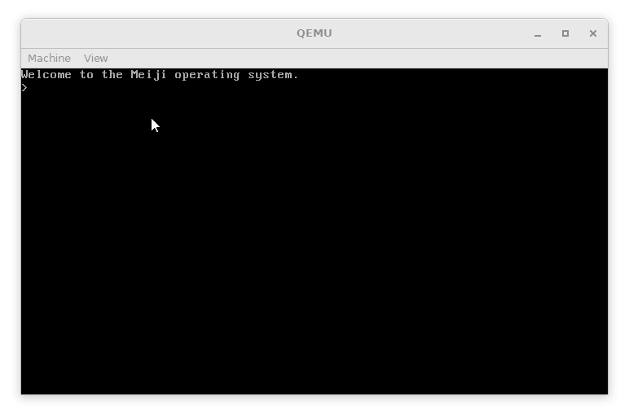

# meiji

A minimal 16-bit operating system written in pure x86 assembly.

## Features

 - Two stage bootloader, first stage loads rest of the code from the disk
 - Text output
 - Text input

### Planned

 - File system like FAT12 or Ext2
 - Executing programs from the file system

## Building

**Requirements:** A working version of [NASM](https://www.nasm.us/) is required.

Building the project can be done by running `./scripts/build.sh` (Unix)
or `.\scripts\build.bat` (Windows) scripts. This will produce a file called
`meiji.bin`.

If [qemu](https://www.qemu.org/) is installed and the `qemu-system-i386` command is available you can also run
`./scripts/run.sh` (Unix) or `.\scripts\run.bat` (Windows) to run the OS in an enumator.

Otherwise the resulting `meiji.bin` file can be used as a floppy disk image in other emulators or even
actual computers **(not tested)**.

## License

Licensed under the [MIT License](LICENSE.md).
